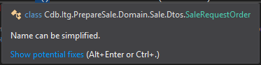

# Formatação

## Linhas em branco

Neste tópico abordaremos as definições de uso de linhas em branco para organização visual do código.

### Separação de elementos em classes

Devem haver separações de linhas em branco entre:

- métodos;
- construtores;
- listas de propriedades e/ou campos;
- qualquer outros elementos que formem um "bloco visual", como um uma sub classe, ou a definição de um enum interno.

Exemplo:
```c#
public class Exemplo
{
    private readonly _private1;
    private readonly _private2;
    private readonly _private3;

    public Exemplo()
    {
      // constrói exemplo...
    }

    public string PropriedadeA { get; set; }
    public int PropriedadeB { get; set; }
    public DateTime PropriedadeC { get; set; }

    public void FazerAlgo()
    {
      // faz algo...
    }

    public void FazerAlgoDiferente()
    {
      // faz algo diferente...
    }
}
```

### Usando quebra de linha para organizar um algorítimo

Devem haver linhas em branco separando instruções de blocos de código do restante do código dentro de um bloco.

Exemplo:

```c#
public void ReporEstoque()
{
  if (!EstaPronto)
  {
    DeixarPronto();
  }

  ContinuarOQuePrecisaFazer();
  var estoque = ObterEstoque();
  var quantidade = ObterQuantidadeAtual(estoque);

  while (quantidade < QuantidadeMaxima)
  {
    quantidade += GerarIncremento(estoque);
  }

  AvisarSetorVendas();
}
```

### Linhas em branco não permitidas

**Não** devem haver linhas em branco em:

- Início e fim de arquivos;
- Início e fim de classes;
- Início e fim de métodos;
- Dentro de uma lista de propriedades e/ou campos;
- Inícios e finais de blocos de chaves.

Também não deve haver uma separação maior que 1 linha em branco aos locais em que se aplica o uso de linhas em branco.

## Complexidade em condicionais encadeadas

Não devem haver mais do que 3 expressões boleanas concatenadas dentro de condicionais encadeadas.

Exemplos incorreto:

```C#
if (Traje.Tipo == TipoDeTrajeEsperado
  && (
    IdadeAtual >= IdadeMinima
    || EstaAcompanhadoDeResponsavel
  )
  && PossuiIngresso)
{
  // if com 4 condicionais boleanas
}
```

Exemplos corretos:

```C#
var haResponsabilidadeLegal = IdadeAtual >= IdadeMinima
    || EstaAcompanhadoDeResponsavel;

if (Traje.Tipo == TipoDeTrajeEsperado
  && haResponsabilidadeLegal
  && PossuiIngresso)
{
  // if com 3 expressões boleanas
}
```

Usando uma classe rica e indo além:

```C#
// Definição de propriedades na classe com getter:
public bool HaResponsabilidadeLegal => IdadeAtual >= IdadeMinima || EstaAcompanhadoDeResponsavel; // Apenas 2 operadores aqui
public bool PossuiTrajeAdequado => Traje.Tipo == TipoDeTrajeEsperado;
public bool PodeEntrar => HaResponsabilidadeLegal && PossuiTrajeAdequado && PossuiIngresso; // Apenas 3 operadores aqui

// Código comportamental dentro do algorítimo:
if (PodeEntrar)
{
  // if com 1 expressão booleana, diminuindo a complexidade geral do método em que se encontra.
}
```

## Tamanhos

Falaremos aqui sobre definições de tamanho de elementos de codificação.

### Arquivos

Um arquivo de código deve **evitar** ultrapassar 100 linhas.

Se o seu aquivo está maior do que isso, tente abstrair mais, criando novas classes e delegando a elas partes da responsabilidade da classe inicial.

### Métodos

Um método não deve ultrapassar 20 linhas, incluindo sua assinatura e bloco de chaves.

Se um método passar deste tamanho, tente abstraí-lo mais, criando mais métodos, separando melhor a responsabilidade.

Métodos que contiverem apenas uma linhas de código devem ser convertidos em _expression bodied methods_.

### Linhas

Não usar mais de uma instrução por linha. Considera-se instrução tudo que é finalizado por um ponto e vírgula. Salvo exceção, a instrução _for_, neste caso, use o bom senso para quebrar ou não linhas.

Linhas não podem ultrapassar **120** caracteres, salvo exceções por nomes grandes de elementos de código.

Caso ultrapasse o limite de caracteres, quebre corretamente as expressões dessa linha em várias linhas.

#### Quebrando linhas

**Uma vez que for necessário** quebrar linhas, a linha deve ser quebrada em **todos os locais possíveis**, sendo locais de quebra de linha:

- Acesso a métodos e/ou propriedades por ponto ( **.** );
- Separação por vírgula de parametros em declarações ou consumos de métodos;

Expressões lambdas, quando necessário, podem ser quebradas após a declaração do lambda ( **=>** ).

Mantenha cada nova linha com a identação alinhada corretamente ao nível de recuo que ela pertencem.

## Identação

A identação deve ser de 4 espaços em branco para cada nível de recuo/profundidade.

Nunca usar caracter de tabulação para fazer identação.

Para automatizar, o Visual Studio por padrão preenche com espaços em branco quando pressionamos tab.

## Uso de chaves

Sempre use chaves para cada novo sub-nível de recuo do algorítimo, mesmo que seja uma instrução única.

Exemplo incorreto:

```c#
if (bla)
    DoIt();
```

Exemplo correto:

```c#
if (bla)
{
    DoIt();
}
```

## Parâmetros e retornos de métodos

Um método não deve ter mais do que **três** parâmetros.

Se o seu método contém mais do que 3 paramêtros, algumas coisas poderão ser tentadas:

- Encapsular os parâmetros em um objeto de transporte que resultará em um único parametro no método;
- Separar o método em métodos menores, melhorando a separação de responsabilidade e fazendo cada um deles depender de menos parâmetros.

Para retornar dados em um método, evite usar `out` e `ref` em parâmetros e tome bastante cuidado ao retornar tuplas.
Quando precisar retornar várias informações em um método, dê referência a retornar objetos complexos, mas também reflita se seu método não tem responsabilidades demais e se não pode ser quebrado em métodos menores. Acima de tudo, tenha bom senso na decisão.

## Comentários

Evite ao máximo deixar comentários explicativos sobre o código, ao invés disso, tente melhorar a legibilidade do código para o que o código consiga explicar por sí só o que está fazendo.

Se precisar escrever comentários, atente-se a gramática correta e escrita formal.

Em nenhuma hipotese versione código comentado com a intenção de manter um back-up, afinal, back-up de códigos antigos é papel do versionador, não de comentários.

## Usando espaços em branco para separação de elementos dentro de uma instrução

Use um, e apenas um, espaço em branco para separar elementos nos seguintes casos:

- Ao consumir métodos com **mais de um** parametro, **após a vírgula** de cada parametro informado;
- Ao declarar métodos com **mais de um** parametro, **após a vírgula** de cada parametro declarado;
- Entre operadores e operandos de uma expressão binária, ternária ou booleana (**+**, **-**, **==**, **&&**, **??**, etc.).
  Correto: "`varA + varB`". Incorreto: "`varA+varB`";

## Declaração de variáveis

Sempre prefira usar **var** para declarar variáveis. Salvo exceção em casos que o compilador não consegue inferir o tipo e exige a definição literal.

Sempre declare variáveis o mais perto possível de seu uso.

## Invocando construtores e inicializando instâncias

Ao chamar construtores e inicializar a instância simultaneamente, caso o construtor não possua parâmetros, suprima os parênteses.

Exemplo incorreto:

```c#
var pessoa = new Pessoa()
{
    Nome = "Pafúncio da Silva"
};
```

Exemplo correto:

```c#
var pessoa = new Pessoa
{
    Nome = "Pafúncio da Silva"
};
```

## Nomeclaturas gerais, propriedades, campos e variáveis

Propriedades (properties): prefira usar propriedades para membros publicos (public) ou protegidos (protected), e nomear no padrão **UpperCamelCase**.

Exemplo:
```c#
public int Age { get; set; }
protected DateTime CreatedAt { get; set; }
```

Campos (fields): prefira usar campos para membros privados (private). Sua nomeclatura deve respeitar o padrão **lowerCamelCase**. Atente-se ao fato do padrão de uso do **_** (**underline**) no nome de membros privados, alguns projetos preferem usar underline como prefixo do nome de todos os campos/mebros privados, outros não. Siga sempre o mesmo padrão do projeto que está trabalhando.

Exemplo:
```c#
private int _age;
private DateTime _createAt;
```

ou:

```c#
private int age;
private DateTime createAt;
```

Se uma propriedade ou campo são atribuídos apenas nos construtores, defina-os como **readonly**.

Exemplo:
```c#
public int Age { get; } // Propriedade read-only, sem o "set"

private readonly DateTime _createAt; // Campo read-only
```

### Outros padrões de nomeclatura

Use o padrão **UpperCamelCase** para todos os seguintes casos:

- partes de um namespace;
- interfaces;
- classes;
- métodos;
- constantes;
- estruturas (struct);
- enums e valores de enums.

Ao escolher um nome, evite ao máximo usar abreviações e tenha bom senso ao escolher o nome, refletindo sobre termos mais objetivos e que representam bem a finalidade de cada elemento.

## Inferência de tipos

Em vários casos, tanto o compilador, como o Intellisense, conseguem inferir tipos de maneira automática, sem a necessidade de declaração explícita.

Nesses casos, a IDE do Visual Studio costuma deixar a declaração explicita marcada com um aspecto "apagado".

Nesses casos de declaração desnecessária, prefira remover a declaração explicita, permitindo a inferência e deixando o código mais limpo.

Exemplo de declaração explicita desnecessária:


Note que a referência à `SaleRequestOrder` está discretamente apagada. Ao parar o mouse em cima dela, a seguinte dica será exibida:



Ao ajustar o código, o resultado será:

```c#
salesData.Any()
```

## Ferramentas de produtividade

Algumas ferramentas podem nos ajudar muito a manter o código limpo e bem formatado. Nesta seção citaremos algumas.

### Productivity Power Tools

Essa é uma extensão gratuíta para Visual Studio que adiciona muitas facilidades de codificação.

Link no marketplace: https://marketplace.visualstudio.com/items?itemName=VisualStudioPlatformTeam.ProductivityPowerPack2017

Também pode ser baixada diretamente no gerenciador de extenções do Visual Studio e é uma extensão modular que traz várias pequenas extenções, mas não se preocupe, todas as sub-extenções são adicionados ou removidas com apenas 1 clique ao adicionar ou remover a extensão principal.

Algumas funcionalidades interessantes presentes:

- Marcação visual de arquivos com problemas no _Solution Explorer_;
- Remover _usings_ desnecessários automaticamente ao salvar o arquivos (não ativada por padrão);
- Formatar o código automaticamente ao salvar (não ativada por padrão).

Existem várias funcionalidades bem úteis nessa ferramenta.

### Sonar Lint

Esta extensão para Visual Studio, também gratuíta, permite executar a verificação do Sonar localmente, porém, apenas nos arquivos que estão abertos/em edição. É uma verificação mais superficial por não analizar a solução como um todo, mas já facilita muitas coisas.

Link no marketplace: https://marketplace.visualstudio.com/items?itemName=SonarSource.SonarLintforVisualStudio2019

Também pode ser baixada diretamente no Visual Studio.

Quando baixada, esta extensão usará as regras padrões do Sonar, o que já é muito bom por si só. Porém, é possível referênciar um servidor de Sonar existente para usar as mesmas regras definidas nele.